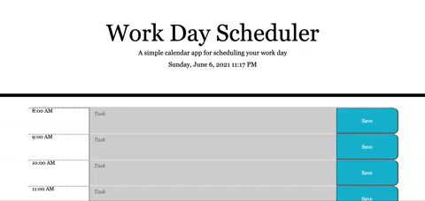

# Jessica Kelley - Work Day Scheduler

## Preview:

Check out this [work day scheduler](https://jessicaakelley.github.io/work-day-scheduler/)!

## The Task:

Create a work day scheduler that:

- Displays current day at top of scheduler upon opening
- Provides time blocks for standard business hours
- Color codes time blocks to indicate whether in past, present, or future
- Allows user to enter an event when clicking on a time block
- Utilizes local storage to save event text

For additional details, please refer to the [Gitlab](https://ucb.bootcampcontent.com/UCB-Coding-Bootcamp/ucb-virt-bo-fsf-pt-04-2021-u-b/tree/master/05-Third-Party-APIs/02-Challenge) project requirements for Challenge 5.

## Technologies Used:

- HTML
- CSS
- JavaScript
- JQuery
- Bootstrap
